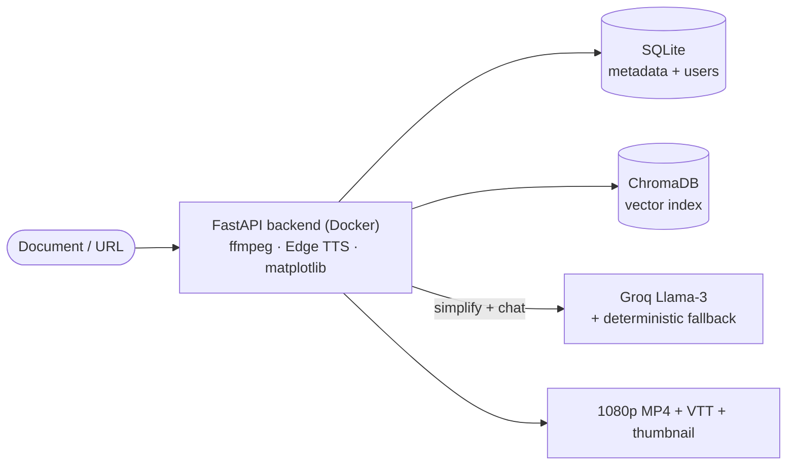

# Video Nuggets OS

**Turn any document into a narrated, auto-advancing video lesson — with charts, captions, and a Q&A bot — backed by a real FastAPI media pipeline, deployed as a live app on Vercel.**


Video Nuggets OS is a document-to-video learning platform. The real pipeline —
**parse → simplify → visualize → slides → narrate → compose** — turns a document
into a 1080p MP4 lesson, then makes it queryable through a retrieval chatbot that
cites the source nugget.

- **Live app:** https://video-nuggets.vercel.app
- **Architecture page:** https://video-nuggets.vercel.app/architecture

> **How the demo is hosted.** The full pipeline (ffmpeg, Edge TTS, ChromaDB) is a
> Dockerized FastAPI backend in [`backend/`](backend/) that runs locally. To keep
> the public demo instant, free, and serverless, that pipeline was run **once**
> to render a small library of original nuggets, which is served on Vercel as
> static media plus one thin serverless function (library + grounded chatbot).
> See [Why it's deployed this way](#why-its-deployed-this-way).

---

## Why I built this

Good documentation is everywhere; the *patience* to read it isn't. Video Nuggets
OS takes the document you already have and turns it into the five-minute video
you'd actually watch — explained in plain language, with a visual per idea and a
voice reading it to you — then makes that content queryable. It's a complete
system: a React frontend, a FastAPI backend running a real media pipeline
(ffmpeg, Edge TTS, matplotlib), a SQLite metadata store, and a ChromaDB-backed
RAG chatbot.

---

## Architecture

### Deployed (this demo, 100% on Vercel)


### The full pipeline (the FastAPI backend, runnable locally)



The deployed **Architecture** page renders both views live.

### The pipeline → backend services

| Stage | What it does | Service |
| --- | --- | --- |
| **Parse** | PDF / PPTX / TXT / image (OCR) / URL → clean sections | `content_parser.py` |
| **Simplify** | "Explain-like-I'm-6" rewrite with analogies | `content_simplifier.py` (Groq Llama-3 → deterministic fallback) |
| **Visualize** | Comparison / architecture / flow / key-point charts | `visualization_gen.py` (matplotlib) |
| **Slides** | 1920×1080 frames + animated storyboard | `slide_image_generator.py` + `animation/` |
| **Narrate** | Neural narration + caption timelines | `tts_service.py` (Edge TTS) |
| **Compose** | Mux frames + audio → MP4 + VTT + thumbnail | `video_composer.py` (ffmpeg) |
| **Q&A** | Chunk + embed + retrieve, grounded chat | `chatbot/` (ChromaDB + MiniLM) |

---

## Why it's deployed this way

The backend does real, heavy work: `ffmpeg` muxing (100s+ per video), neural TTS,
and a vector store. That's a long-running container, not a serverless fit. So
instead of paying for an always-on host, the pipeline was run **once** locally to
produce a committed seed library, and the public demo is served entirely from
Vercel:

- **Static frontend** — the React/Vite app on Vercel's CDN.
- **Static media** — the 3 rendered MP4s, VTT transcripts, and thumbnails under
  `/static`.
- **One serverless function** (`api/[...path].js`) — backs `/api/videos` (library
  + detail) and `/api/chat` (grounded retrieval over the committed transcripts,
  using Groq Llama-3 if `GROQ_API_KEY` is set, deterministic otherwise), plus thin
  demo auth.

**Live generation, uploads, and the content monitor run in the full backend** —
clone the repo and run it locally (below) to generate new nuggets from your own
documents.

**Demo accounts:** `admin / admin123` · `viewer / viewer123`.

---

## Tech stack

- **Frontend:** React 18, Vite, TypeScript, Tailwind CSS, React Router
- **Backend (pipeline):** FastAPI, Python 3.11, SQLAlchemy, APScheduler, Uvicorn
- **Media:** ffmpeg, Microsoft Edge TTS, Pillow, matplotlib, python-pptx
- **AI / retrieval:** Groq Llama-3 (free, OpenAI-compatible) with a deterministic
  fallback; ChromaDB + MiniLM embeddings for RAG
- **Data:** SQLite (metadata + demo users), ChromaDB (vectors), static MP4 / VTT
- **Infra (demo):** Vercel static hosting + a Vercel serverless function; the full
  backend ships as a Docker image for local/self-hosted runs

---

## Run it locally (the full pipeline)

### Backend

```sh
cd backend
python3.11 -m venv .venv && source .venv/bin/activate
pip install -r requirements.txt
cp .env.example .env          # optional: add a free GROQ_API_KEY
uvicorn app.main:app --reload --port 8000
```

Requires `ffmpeg` on your PATH. On first run the committed seed library is loaded
automatically. Without a `GROQ_API_KEY`, the deterministic simplifier is used.

### Frontend (against the local backend)

```sh
cd frontend
npm install
echo "VITE_API_URL=http://localhost:8000" > .env.local
npm run dev
```

With `VITE_API_URL` set, the app talks to your local FastAPI backend — so uploads
and live generation work. Leave it unset to run against the bundled static demo.

### Re-render the seed library (optional, one-time)

```sh
cd backend && .venv/bin/python build_seed.py   # render sample docs into backend/seed/
cd .. && python3 scripts/build_vercel_data.py  # publish seed to static assets + /api data
npm install && node scripts/embed_corpus.mjs   # precompute MiniLM chunk embeddings for chat
```

---

## Deploy (Vercel, no separate backend host)

The repo root `vercel.json` builds `frontend/`, serves `frontend/dist` as an SPA,
serves the pre-rendered media from `/static`, and routes `/api/*` to the
serverless function in `api/`.

```sh
vercel --prod        # from the repo root (uses the authenticated Vercel CLI)
```

- **Optional:** set `GROQ_API_KEY` (and `GROQ_MODEL`) as Vercel env vars to upgrade
  the chatbot from the deterministic fallback to Groq Llama-3. Everything works
  without it.
- No `VITE_API_URL` is needed in production — the app calls its own origin.

---

## Project structure

```
video-nuggets/
├── api/                      # Vercel serverless function for the demo
│   ├── [...path].js          # /api/videos · /api/chat · auth · stubs
│   └── _data/                # library.json · videos.json · corpus.json (from seed)
├── backend/                  # the real FastAPI app + render pipeline
│   ├── app/                  # api · services · chatbot · models · seed.py
│   ├── seed/                 # committed demo nuggets (mp4/vtt/thumb) + chroma index
│   ├── build_seed.py         # one-time local renderer for the seed library
│   └── Dockerfile
├── frontend/                 # React + Vite + Tailwind app
│   └── public/static/        # rendered MP4s / VTT / thumbnails served by Vercel
├── scripts/
│   └── build_vercel_data.py  # seed → static assets + /api data bridge
└── vercel.json               # build + SPA + /api routing
```

---

## Project phases

- **Phase 1 — Sanitize & port.** Lift the FastAPI backend into this repo, strip
  all proprietary assets and artifacts, and trim the image.
- **Phase 2 — Neutralize.** Generic brand palette, original sample content,
  neutral narration/slides, and an optional, configurable content monitor.
- **Phase 3 — Free LLM.** A Groq Llama-3 provider for the simplify step and chat,
  behind a deterministic fallback so it never costs anything or breaks.
- **Phase 4 — Seed library.** A one-time local render of three original nuggets
  (MP4 + transcript + vector index), committed for an instant demo.
- **Phase 5 — Frontend.** Env-driven API base, neutral branding, and a new
  **Architecture** page that renders the live stack and pipeline.
- **Phase 6 — Deploy on Vercel.** Static frontend + pre-rendered media + one thin
  serverless function back the library and grounded chatbot — no always-on host.

### Roadmap

- Optional managed backend (Fly.io / a container host) for live cloud generation.
- Streamed, progress-aware generation (SSE) instead of background polling.
- Word-level caption highlighting from the Edge TTS timelines.
- Swap SQLite for managed Postgres + object storage for durable uploads.

---

## License & disclaimer

**All Rights Reserved** — see [`LICENSE`](LICENSE). Published for portfolio review
and evaluation only.

This is an **independent, original prototype**. It is **not affiliated with,
endorsed by, or associated with Nutanix, Inc.** "Nutanix" and the "Nutanix Bible"
are referenced only as examples of the kind of publicly available document this
tool is designed for. **No Nutanix trademarks, brand assets, slide templates,
validated designs, or proprietary materials are included** in this repository.
All sample texts are original and vendor-neutral.
