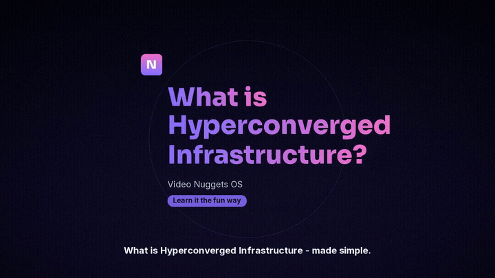
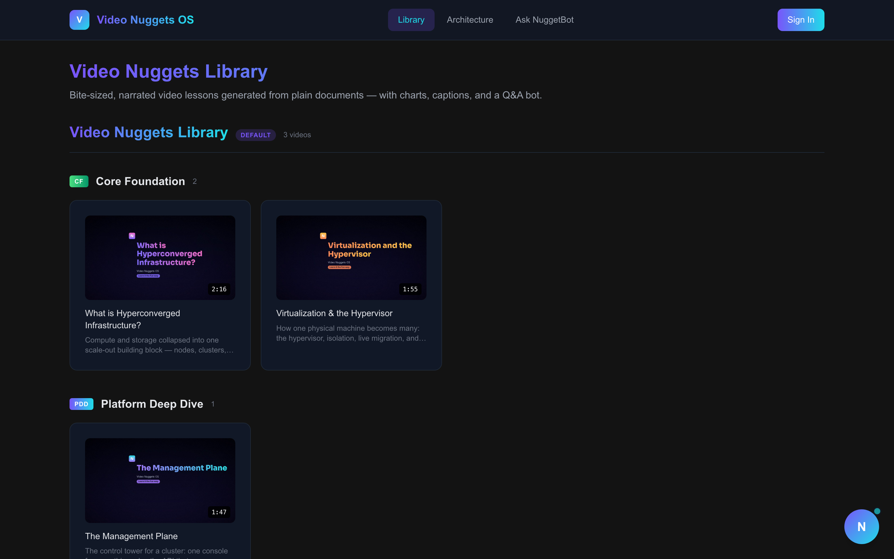
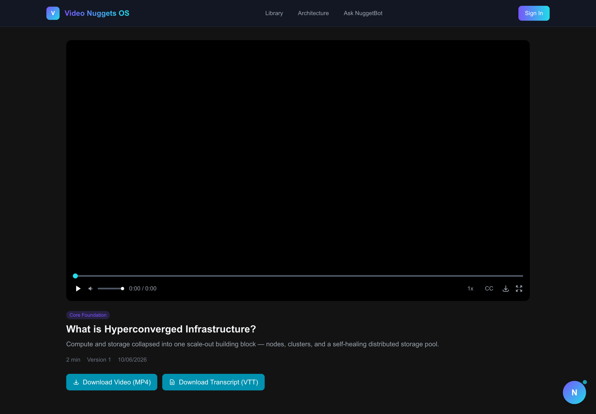
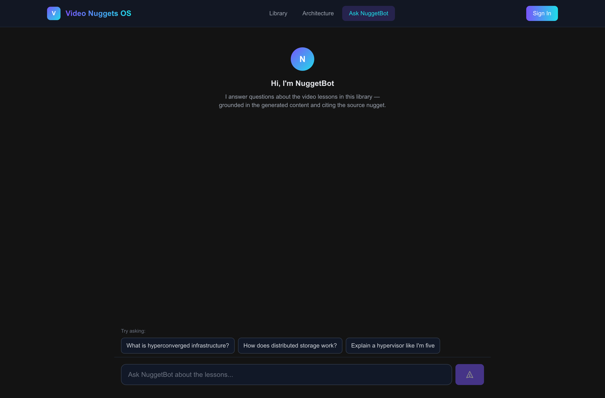
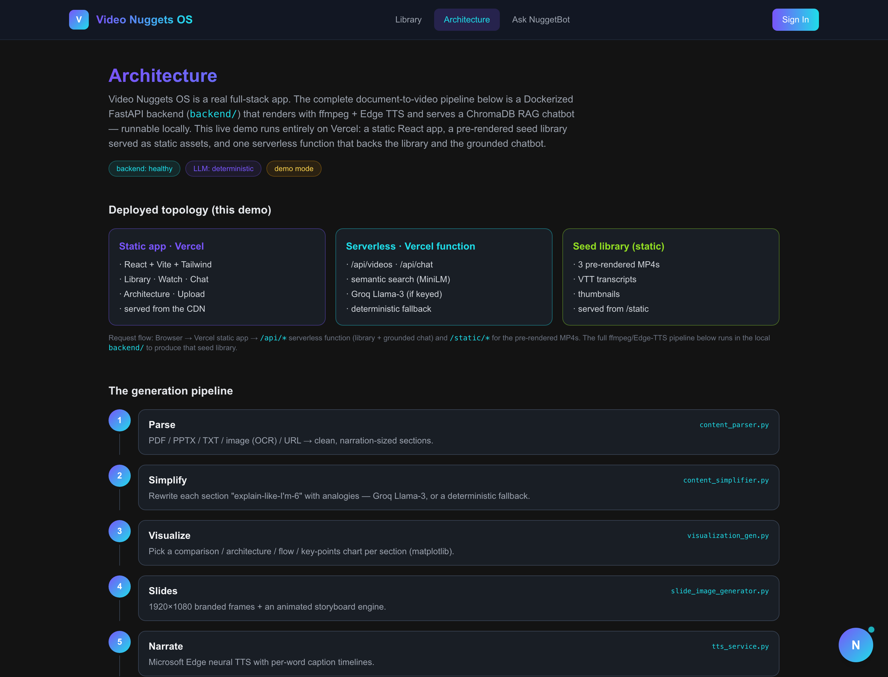
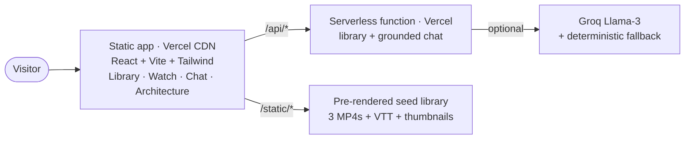
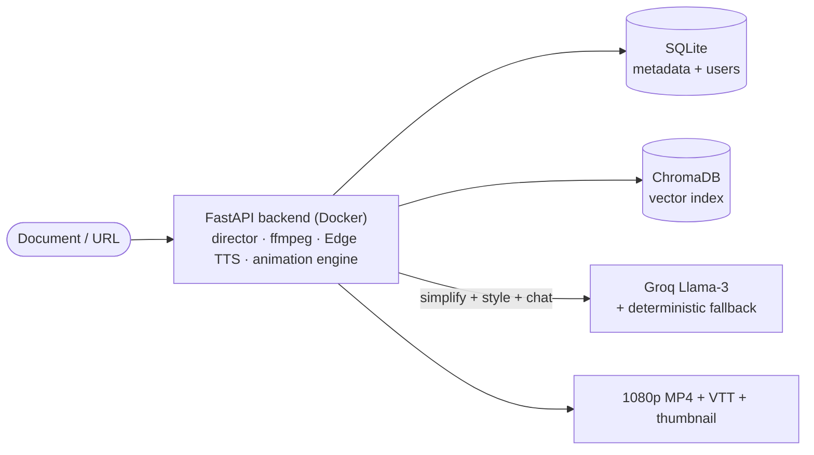

# Video Nuggets OS

**Turn any document into a narrated, visually-animated video lesson — with moving diagrams, captions, and a source-grounded Q&A bot — backed by a real FastAPI media pipeline and a video-intelligence engine that designs every frame on a standard operating plan.**


| | |
| --- | --- |
| **Instant static demo (Vercel)** | **https://video-nuggets.vercel.app** |
| **Live generation (Render — upload your own doc)** | **https://video-nuggets-os.onrender.com** |
| **Live architecture page** | https://video-nuggets.vercel.app/architecture |

> **Demo accounts:** `admin / admin123` · `viewer / viewer123`
> The Render service is on the free tier, so the first request after idle takes **30–60s to cold-start** — give it a moment, then upload a PDF/TXT/URL and watch a lesson render live.

---

## Watch it work

A document goes in; a narrated, animated explainer comes out — moving diagrams that build as the voice explains them, kinetic captions, and a cohesive visual style chosen for the topic.



<table>
  <tr>
    <td width="50%"></td>
    <td width="50%"></td>
  </tr>
  <tr>
    <td align="center"><b>Library</b> — auto-built playlists, thumbnails, durations</td>
    <td align="center"><b>Watch</b> — captions, 1× speed, MP4 + VTT downloads</td>
  </tr>
  <tr>
    <td width="50%"></td>
    <td width="50%"></td>
  </tr>
  <tr>
    <td align="center"><b>NuggetBot</b> — answers grounded in the lessons, cites the nugget</td>
    <td align="center"><b>Architecture</b> — the deployed topology + the 7-stage pipeline</td>
  </tr>
</table>

---

## The story — why it exists

Good documentation is everywhere; the *patience* to read it isn't. Every team ships
dense PDFs, wikis, runbooks, and decks — and then watches people skim, bounce, or
ping a human instead. The knowledge exists. The format is the problem.

The fix people reach for is "make a video," but video is expensive: a script,
a voice, slides, motion design, edits. So the long tail of internal docs and
niche topics never gets one. Meanwhile the content that *is* turned into video
on the cheap looks like exactly that — static bullet slides with a robot voice,
which is the thing nobody watches.

**Video Nuggets OS exists to collapse that cost to ~zero while raising the bar on
quality.** Point it at a document and it returns the five-minute explainer you'd
actually finish: plain-language narration, one moving visual per idea, captions,
and a chatbot that can answer follow-up questions and cite the exact lesson it
came from. The wager is simple — *the format, not the information, is what's
broken,* and the format is now automatable end-to-end.

---

## What it actually is — product intent

Video Nuggets OS is a **document-to-video learning platform**: a complete,
runnable system, not a slide-maker wrapper.

- A **React + Vite + Tailwind** frontend (Library · Watch · Ask · Architecture).
- A **FastAPI media pipeline** that does real work — `ffmpeg` muxing, neural TTS,
  an animation engine, and a vector store.
- A **video-intelligence engine** (the moat — see below) that decides the visual
  style, mines diagrams from the source, and enforces a non-negotiable quality bar.
- A **retrieval chatbot** (ChromaDB + MiniLM) that makes the rendered library
  queryable and grounded.

The product intent is deliberately narrow and deep: **be the best in the world at
turning one document into one genuinely watchable explainer**, with zero recurring
cost and no proprietary lock-in. Everything else (playlists, accounts, a content
monitor, live upload) is scaffolding around that core promise.

### What goes in / what comes out

| In | Out |
| --- | --- |
| PDF · PPTX · TXT · image (OCR) · URL | A 1080p MP4 with animated diagrams + neural narration |
| — | A `.vtt` caption track + a thumbnail |
| — | A searchable, source-cited chatbot over the lesson |
| — | A playlist entry, organized by topic and difficulty |

---

## The moat — a video-intelligence engine with a standard operating plan

Cheap auto-video looks cheap. The differentiator here is an **engine that treats
"visually engaging and on-brand" as a hard requirement, not a hope.** Every video —
today, tomorrow, and for any future document — is generated against a written
**Standard Operating Plan (SOP)** with auto-correcting, fail-safe enforcement.

- **Visual-first, not text-first.** The narration carries the words, so slides
  carry *motion and meaning*: animated node-graphs, flow dots, and diagrams that
  build in sync with the voice. Text-heavy cards are automatically upgraded to a
  visual.
- **Reads the source for real diagrams.** It extracts figures and architecture
  diagrams from the uploaded PDF (`PyMuPDF`) and animates the *actual* figure with
  callouts — falling back to a deterministically **synthesized** diagram when no
  figure fits.
- **Color psychology, automatically.** A style-intelligence layer classifies the
  content's intent (trust, growth, energy, calm…) and picks a cohesive,
  legibility-checked palette, type scale, and motion mood to match.
- **A 12-rule SOP, enforced.** Cohesive look, WCAG-contrast legibility, visual-first
  guarantee, a strict on-screen text budget, an opening hook, a motion floor (no
  dead air), narration sync, pacing bounds, brand neutrality, and zero-cost
  determinism. If a rule would be violated, the engine **auto-corrects and logs the
  adjustment** instead of shipping something off-spec.
- **Zero-cost determinism.** With no API key, every rule is still met via
  deterministic fallbacks — the engine never *needs* a paid model to produce a
  compliant, on-brand video.

> Design principle: **spend the intelligence on the video engine, and the rest of
> the product becomes easy.** The SOP is the single source of truth; the director
> is the single chokepoint that every video passes through.

---

## Who it's for — market fit & personas

The wedge is **internal enablement and technical education** — places with lots of
dense docs, real pressure to make them stick, and no motion-design budget.

| Persona | The pain today | The job they hire this for |
| --- | --- | --- |
| **The new hire / overwhelmed learner** | A 60-page onboarding PDF nobody reads | "Give me the 5-minute version I'll actually watch — and let me ask follow-ups." |
| **Docs & DevRel teams** | Great docs, low completion, no video budget | "Turn our existing docs into explainers at scale, on-brand, without an editor." |
| **Sales engineers / solutions architects** | Re-explaining the same architecture on every call | "A crisp, animated explainer per concept I can send instead of a wall of text." |
| **Educators & course creators** | Slides are static; editing eats the week | "Auto-generate watchable lessons from my notes, with a study bot attached." |
| **Hiring managers evaluating me** | Portfolios that are screenshots, not systems | "Show me a real, deployed, end-to-end product — and let me break it." |

**Beachhead → expansion.** Start where the pain is sharpest and the content is
already written (technical onboarding & product docs), prove completion-rate lift,
then expand into adjacent education and customer-facing enablement.

**Why now.** Free, OpenAI-compatible inference (Groq), neural TTS (Edge TTS), and
a deterministic animation engine make broadcast-ish explainers possible at **$0
marginal cost** — the economics that previously gated this only to funded teams
just flipped.

---

## How we show up — brand & positioning

**Category:** the *document-to-video learning OS*.
**One-liner:** *Any document, watchable in five minutes.*
**Positioning statement:** *For teams whose knowledge is trapped in documents,
Video Nuggets OS turns any file into a narrated, animated explainer with a
source-grounded Q&A bot — unlike DIY video or static slide-makers, it ships a
visual-first quality bar automatically and runs at zero cost.*

**Brand pillars**

1. **Watchable by default** — engagement is a product requirement enforced by the SOP.
2. **Grounded & honest** — the bot cites the nugget; no hallucinated authority.
3. **Zero-cost, no lock-in** — free tiers and deterministic fallbacks, end to end.
4. **Vendor-neutral** — your brand and content, never ours stamped on top.

**Voice & tone:** clear, warm, and concrete — explain-like-I'm-curious, never
condescending. We earn attention in the first five seconds and keep it with motion.

**Visual identity:** a calm, modern dark canvas; a purple→teal gradient signature;
bundled Sora/Inter typography; and a palette the engine *chooses per topic* using
color psychology. The product's look and the videos' look come from the **same
design system**, so the brand is coherent from the landing page to the last frame.

---

## Go-to-market & product-market-fit strategy

- **Distribution wedge.** The output *is* the marketing: every generated nugget is
  a shareable artifact with the brand baked in. Seed with high-intent public docs,
  let the videos travel.
- **Land:** free, instant static demo (Vercel) to prove the experience with zero
  friction; **expand:** live generation (Render) so a team can try it on *their own*
  document in one click.
- **Activation metric:** *time-to-first-watchable-nugget* (upload → finished MP4).
- **North-star metric:** *lesson completion rate* vs. the source doc's read-through —
  the number that proves the format thesis.
- **Moat compounding:** the SOP + animation engine improves every video at once;
  quality scales with the engine, not with headcount.
- **Pricing thesis (future):** free self-serve forever (zero-cost core), paid for
  brand kits, private libraries, durable storage, and team workspaces.

---

## How it works — architecture

### Deployed (the instant demo, 100% on Vercel)



### The full pipeline (FastAPI backend — runs live on Render, or locally)



The deployed **Architecture** page renders both views live.

### The pipeline → backend services

| Stage | What it does | Service |
| --- | --- | --- |
| **Parse** | PDF / PPTX / TXT / image (OCR) / URL → clean sections (+ mined figures) | `content_parser.py` · `figure_index.py` |
| **Simplify** | "Explain-like-I'm-6" rewrite with analogies | `content_simplifier.py` (Groq → deterministic fallback) |
| **Direct** | Pick style, match figures, synthesize diagrams, **enforce the SOP** | `video_director.py` · `theme_engine.py` · `engine_policy.py` |
| **Visualize** | Animated node-graphs, source-figure callouts, kinetic beats | `diagram_synth.py` · `animation/` |
| **Slides** | 1920×1080 themed frames + animated storyboard | `slide_image_generator.py` |
| **Narrate** | Neural narration + per-word caption timelines | `tts_service.py` (Edge TTS) |
| **Compose** | Mux frames + audio → MP4 + VTT + thumbnail | `video_composer.py` (ffmpeg) |
| **Q&A** | Chunk + embed + retrieve, grounded chat with citations | `chatbot/` (ChromaDB + MiniLM) |

---

## Why it's deployed two ways

The backend does real, heavy work: `ffmpeg` muxing (100s+ per video), neural TTS,
an animation renderer, and a vector store — a long-running container, not a
serverless fit. So the project ships **two independent, complementary deployments**:

- **Vercel — the instant demo.** The pipeline was run **once** locally to render a
  small seed library, served as static MP4s/VTT/thumbnails plus one thin serverless
  function (`api/[...path].js`) that backs the library and the grounded chatbot.
  Instant, free, nothing to cold-start.
- **Render — the live app.** The all-in-one Docker image (frontend + FastAPI) runs
  the **real pipeline** so anyone can upload a document and watch a lesson render.
  Free tier, so it sleeps when idle and can be tight on memory for large uploads —
  upgrade the plan for reliable heavy generation.

Same image, same frontend: the app uses a **relative API base**, so on Render
`/api/*` is the real FastAPI, and on Vercel it's the static-demo function.

---

## Tech stack

- **Frontend:** React 18, Vite, TypeScript, Tailwind CSS, React Router
- **Backend (pipeline):** FastAPI, Python 3.11, SQLAlchemy, APScheduler, Uvicorn
- **Media & motion:** ffmpeg, Microsoft Edge TTS, Pillow, NumPy, matplotlib,
  PyMuPDF (figure extraction), python-pptx; bundled Sora/Inter (SIL OFL) fonts
- **Intelligence:** a video director + SOP engine; Groq Llama-3 (free,
  OpenAI-compatible) for simplify/style/chat with a deterministic fallback;
  ChromaDB + MiniLM embeddings for RAG
- **Data:** SQLite (metadata + demo users), ChromaDB (vectors), static MP4 / VTT
- **Infra:** Vercel static hosting + a serverless function (instant demo); an
  all-in-one Docker image on Render (live generation)

---

## Run it locally (the full pipeline)

### Backend

```sh
cd backend
python3.11 -m venv .venv && source .venv/bin/activate
pip install -r requirements.txt
cp .env.example .env          # optional: add a free GROQ_API_KEY
uvicorn app.main:app --reload --port 8000
```

Requires `ffmpeg` on your PATH. On first run the committed seed library loads
automatically. Without a `GROQ_API_KEY`, the deterministic simplifier/style engine
is used — every SOP rule is still met.

### Frontend (against the local backend)

```sh
cd frontend
npm install
echo "VITE_API_URL=http://localhost:8000" > .env.local
npm run dev
```

With `VITE_API_URL` set, the app talks to your local FastAPI backend — so uploads
and live generation work. Leave it unset to run against the bundled static demo.

### Re-render the seed library (optional, one-time)

```sh
cd backend && .venv/bin/python build_seed.py   # render sample docs into backend/seed/
cd .. && python3 scripts/build_vercel_data.py  # publish seed to static assets + /api data
npm install && node scripts/embed_corpus.mjs   # precompute MiniLM chunk embeddings for chat
```

---

## Deploy

### Vercel (instant static demo, no separate backend host)

The repo root `vercel.json` builds `frontend/`, serves `frontend/dist` as an SPA,
serves pre-rendered media from `/static`, and routes `/api/*` to the serverless
function in `api/`.

```sh
vercel --prod        # from the repo root (uses the authenticated Vercel CLI)
```

- **Optional:** set `GROQ_API_KEY` (and `GROQ_MODEL`) as Vercel env vars to upgrade
  the chatbot from the deterministic fallback to Groq Llama-3. Everything works
  without it.
- No `VITE_API_URL` is needed in production — the app calls its own origin.

### Render (the live app — real video generation)

**Live URL: https://video-nuggets-os.onrender.com**

One web service builds the frontend, serves it, and runs the FastAPI pipeline, so
a single URL is the whole app.

1. In Render: **New → Blueprint**, point it at this repo. `render.yaml` provisions a
   Docker web service from the root `Dockerfile` with a `/api/health` check.
2. Plan: `render.yaml` ships with `plan: free`, so **deploying needs no payment
   info**. Free is 512 MB and sleeps when idle, so it cold-starts in 30–60s and can
   OOM on large uploads during `ffmpeg` + embedding. For reliable live generation,
   upgrade to **Standard (2 GB)** (or set `plan: standard` + a `disk:` block).
3. (Optional) Set `GROQ_API_KEY` to sharpen the "simplify" text and chat.
4. Generation is open (`DEMO_MODE=true`) so anyone can upload and try it.

**Link the two:** set `VITE_LIVE_APP_URL` (Vercel env var) to the Render URL and
redeploy Vercel — a "Try live generation" CTA then points demo visitors at the
live app. The two deployments are independent.

---

## Project structure

```
video-nuggets/
├── api/                      # Vercel serverless function for the demo
│   ├── [...path].js          # /api/videos · /api/chat · auth · stubs
│   └── _data/                # library.json · videos.json · corpus.json (from seed)
├── backend/                  # the real FastAPI app + render pipeline
│   ├── app/
│   │   ├── services/         # director, theme/SOP engine, figure_index, diagram_synth
│   │   │   └── animation/    # primitives, templates, storyboard, scene policy
│   │   └── chatbot/          # ChromaDB + MiniLM grounded Q&A
│   ├── seed/                 # committed demo nuggets (mp4/vtt/thumb) + chroma index
│   ├── build_seed.py         # one-time local renderer for the seed library
│   └── Dockerfile
├── frontend/                 # React + Vite + Tailwind app
│   └── public/static/        # rendered MP4s / VTT / thumbnails served by Vercel
├── docs/media/               # README walkthrough GIF + app screenshots
├── scripts/
│   ├── build_vercel_data.py  # seed → static assets + /api data bridge
│   └── embed_corpus.mjs      # precompute MiniLM chat embeddings
├── Dockerfile                # all-in-one image (frontend + FastAPI) for Render
├── render.yaml               # Render blueprint (full live app)
└── vercel.json               # build + SPA + /api routing (static demo)
```

---

## Roadmap

- Streamed, progress-aware generation (SSE) instead of background polling.
- Word-level caption highlighting from the Edge TTS timelines.
- Brand kits — drop in a logo + palette and the engine themes every video to match.
- Swap SQLite for managed Postgres + object storage for durable, multi-tenant libraries.
- Team workspaces and private libraries.

---

## License & disclaimer

**All Rights Reserved** — see [`LICENSE`](LICENSE). Published for portfolio review
and evaluation only.

This is an **independent, original prototype**. It is **not affiliated with,
endorsed by, or associated with Nutanix, Inc.** "Nutanix" and the "Nutanix Bible"
are referenced only as examples of the kind of publicly available document this
tool is designed for. **No Nutanix trademarks, brand assets, slide templates,
validated designs, or proprietary materials are included** in this repository.
All sample texts are original and vendor-neutral.
